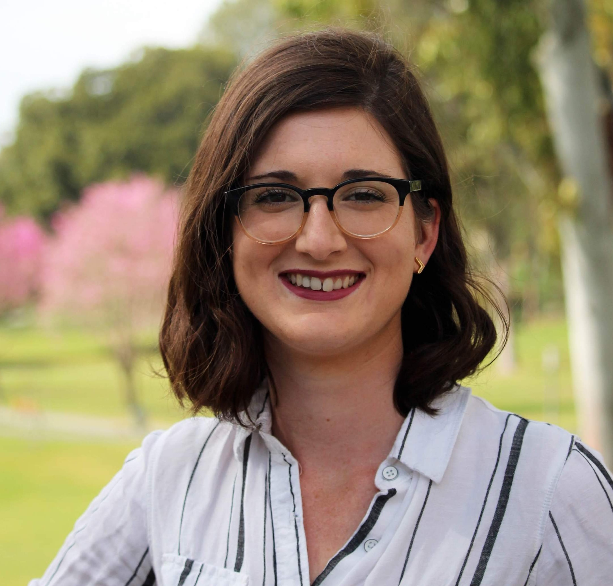
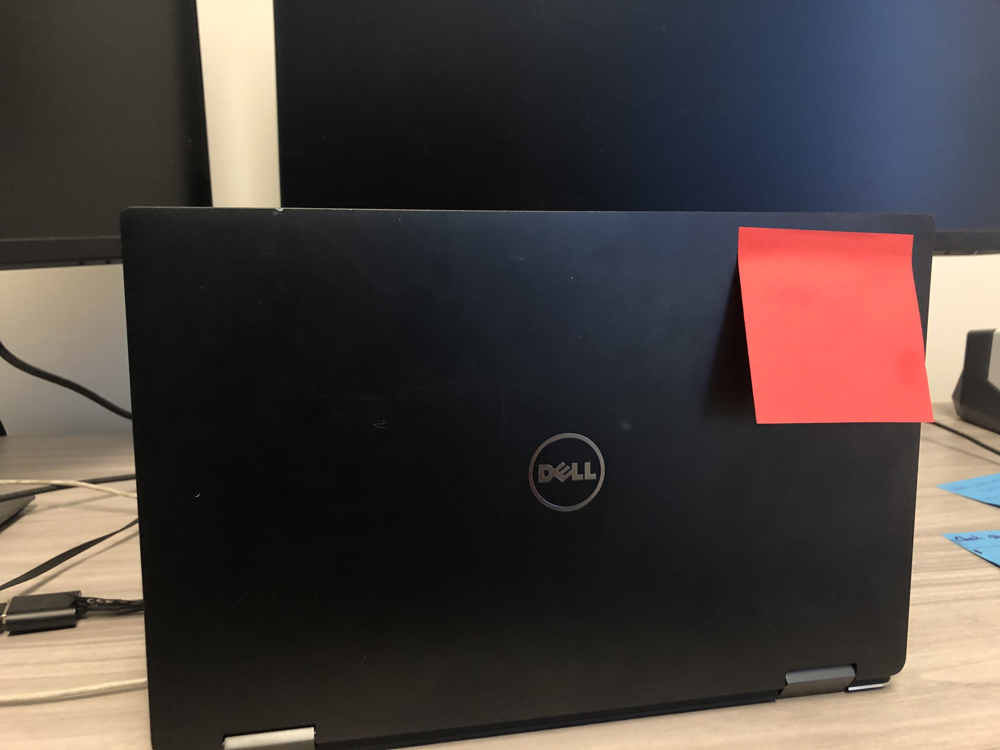
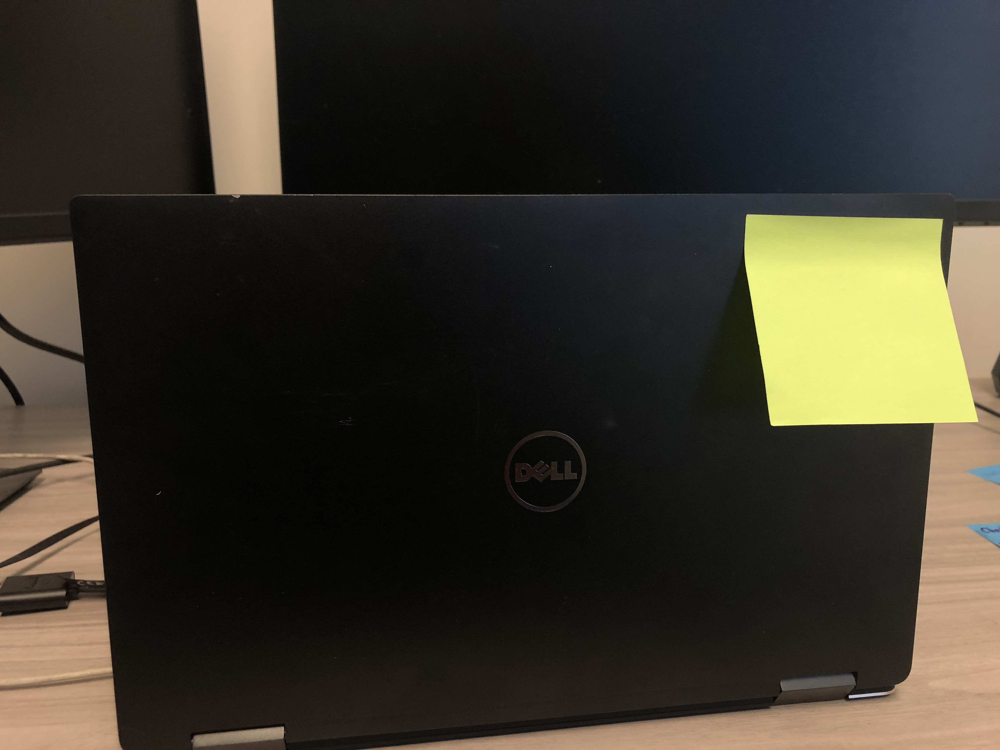

layout: true

<!-- This file by Mine Dogucu is licensed under a  Attribution-ShareAlike 2.5 Generic License (CC BY-SA 2.5) More information about the license can be found at https://creativecommons.org/licenses/by-sa/2.5/ -->
  
<div class="my-header"></div>

<div class="my-footer"> 
 CC BY-SA <a href="https://mdogucu.ics.uci.edu">Mine Dogucu</a></div> 

---

```{r setup, include=FALSE}
knitr::opts_chunk$set(echo = FALSE)
```

class: center, middle

## License

```{r echo=FALSE, out.width='100%', warning=FALSE}
knitr::include_graphics('img/cc-sa.png')
library(emojifont)
library(ggplot2)

```


More information can be found [here](https://creativecommons.org/licenses/by-sa/2.5/)

---
## About Me

- Assistant Professor of Teaching, Department of Statistics.
- I started at UCI in July 2019.
- Fun fact: I do not have kids. It is A LOT of fun _for me_.


---

## About our TA

.pull-left[
```{r echo=FALSE, out.width='80%'}

```
]

.pull-right[
Mary Ryan  
PhD Candidate  
Department of Statistics

]

---

## Meet and Greet

In groups of 2-4 introduce yourself to people around you.

Some questions to consider:

- What questions do you try to answer with data?
- What data do you collect/use for your research?
- What computer tools do you use for data collection/management/analysis?


---


.pull-left[

I need help.   
Can someone help me please?

```{r echo=FALSE, out.width='80%'}

```
.footnote[idea from RStudio workshops]

]


.pull-right[
I am done.   
I cannot wait to help others.

```{r echo=FALSE, out.width='80%'}

```
]

---

class: center, middle

## 3 important tabs

RStudio Cloud - URL on the white board   
slido.com   - Event code on the white board  
[bit.ly/dogucu-workshops](http://bit.ly/dogucu-workshops) - Check for today's materials  


---


## Please do

- Ask questions 
- Ask for help
- Help each other
- Wear a name tag

---
## Please do not

- Copy-paste my code from slides (running into problems while typing is part of the learning).
- Judge anyone or question.

---
## Why R?

- Community (definitely the number 1 reason). 
- It is free.
- It is open source (more on this later).
- Not only the language but also the culture around it mostly favoring open source.

---

## What is tidyverse?

I will explain this later. 

---
##  Data Science Cycle

```{r echo=FALSE, out.width='100%'}
knitr::include_graphics('img/data-cycle.png')
```

.footnote[Image from Grolemund, G., & Wickham, H. (2018). R for data science (CC BY-NC-ND 3.0).]
---

## Note on My Teaching Style

- I do not teach in a linear fashion.
- This is intentional. 
- If you are considering teaching R in your courses or elsewhere, I am happy to discuss pedagogical approaches to teaching R.
- I am happy to discuss teaching data science and data literacy too. 

---

## Fun fact

Throughout the workshop I provide fun facts. Here is the first one: R just turned 20 years old on 2020-02-29.

```{r fig.align ='center'}
ggplot() +
  geom_emoji('birthday') +
  theme_void()
```


---

## Schedule for the Day

__08:45 - 09:00 Introduction__  
09:00 - 09:15 Getting to Know the Basics  
09:15 - 10:15 Data Visualization  
10:15 - 10:30 Break  
10:30 - 12:00 Data Wrangling  
12:00 - 01:00 Lunch  
01:00 - 01:30 Working Locally With R  
01:30 - 02:00 Dealing with Datasets  
02:00 - 02:30 Case Study  
02:30 - 02:45 Break  
02:45 - 03:30 Modeling  
03:30 - 04:00 Everything I did not have time to cover


