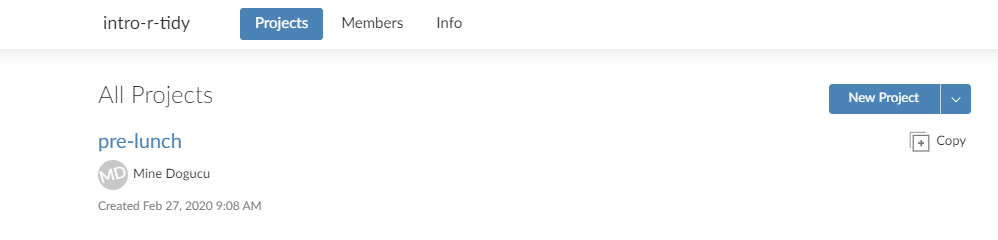
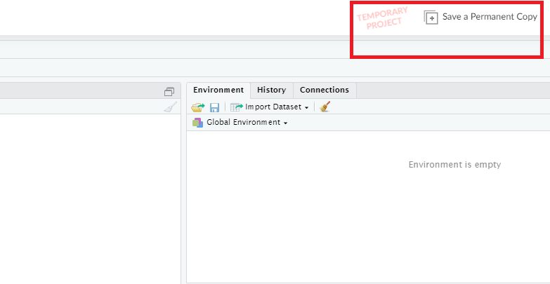
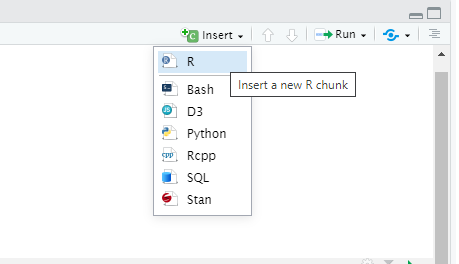
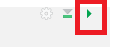

layout: true

<!-- This file by Mine Dogucu is licensed under a  Attribution-ShareAlike 2.5 Generic License (CC BY-SA 2.5) More information about the license can be found at https://creativecommons.org/licenses/by-sa/2.5/ -->
  
<div class="my-header"></div>

<div class="my-footer"> 
 CC BY-SA <a href="https://mdogucu.ics.uci.edu">Mine Dogucu</a></div> 

---


class: center, middle

## License

```{r echo = FALSE, message = FALSE, warning=FALSE}
library(fivethirtyeight)
library(tidyverse)
```


```{r echo=FALSE, out.width='100%'}
knitr::include_graphics('img/cc-sa.png')
```


More information can be found [here](https://creativecommons.org/licenses/by-sa/2.5/)

---
## RStudio Cloud

- Log into RStudio Cloud using the link on the whiteboard

- From Spaces on the left navigation bar intro-r-tidy should be selected. 

- In this workspace, make a copy of the pre-lunch project.


```{r echo=FALSE, out.width='100%'}

```

---

## No Temporary Project

Your project should NOT be temporary. If it says so then save a permanent copy. If you already made a copy you should be good.

```{r echo=FALSE, out.width='100%'}

```

---

## .Rmd

- On the lower right pane in the `Files` tab open the `sample-rmarkdown.Rmd` file. 


---

## Knitting

- Click the Knit button to knit this document and then we will talk about R Markdown documents.

```{r echo=FALSE, out.width='100%'}
knitr::include_graphics('img/knit.png')
```

---

## Our very own .Rmd

- Open `1_basics.Rmd`
- I will do a live demo


---
## Demo - Adding Chunks

```{r echo=FALSE, out.width='100%'}

```

## Demo - Run Code

```{r echo=FALSE, out.width='100%'}

```

---

## Demo - Defining Objects

```{r}
birth_year <- 1950 # note the change in the environment

age <- 2020 - birth_year

age 
```

---

## Demo - Defining Objects

R is case sensitive.

```{r error = TRUE}
Age
```

---
## Demo - Defining Objects

```{r}
name_p <- c("Molly", "Zainab", "Mohsen") #c is a combine function 
# strings come in quotes

kid_p <- c(2, 3, 2) 

```

---
## Demo - Defining Objects

```{r}
data.frame(name = name_p,
           kid = kid_p)

```

---

## Vocabulary

do(something)

do is a function something is an argument

do(something colorful)

do is a function something is an argument colorful is an argument

---

## Looking at Data

Get to know the `candy_rankings` data. 

- Clicking on the data frame in the Environment.
- Clicking on the blue button. 
- Using `glimpse()`

---
## Looking at Data - `glimpse()`

`glimpse()` shows variables and some data values but it is not in the usual row-column format but rather flipped version of this with additional information about the variables and the data frame.

---
## Looking at Data - `glimpse()`

```{r}
glimpse(candy_rankings)
```

---
class: center, middle

## More on Candy Rankings

[The Ultimate Halloween Candy Power Ranking](https://fivethirtyeight.com/features/the-ultimate-halloween-candy-power-ranking/)

---

## Schedule for the Day

__08:45 - 09:00 Introduction__  
__09:00 - 09:15 Getting to Know the Basics__  
09:15 - 10:15 Data Visualization  
10:15 - 10:30 Break  
10:30 - 12:00 Data Wrangling  
12:00 - 01:00 Lunch  
01:00 - 01:30 Working Locally With R  
01:30 - 02:00 Dealing with Datasets  
02:00 - 02:30 Case Study  
02:30 - 02:45 Break  
02:45 - 03:30 Modeling  
03:30 - 04:00 Everything I did not have time to cover


