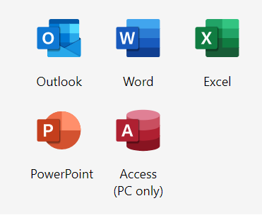
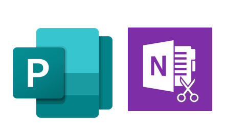

layout: true

<!-- This file by Mine Dogucu is licensed under a  Attribution-ShareAlike 2.5 Generic License (CC BY-SA 2.5) More information about the license can be found at https://creativecommons.org/licenses/by-sa/2.5/ -->
  
<div class="my-header"></div>

<div class="my-footer"> 
 CC BY-SA <a href="https://mdogucu.ics.uci.edu">Mine Dogucu</a></div> 

---
class: center, middle

## License

```{r echo=FALSE, out.width='100%'}
knitr::include_graphics('img/cc-sa.png')
```


More information can be found [here](https://creativecommons.org/licenses/by-sa/2.5/)

---
## R project

- Whenever we do a data project (paper, analysis etc.) we always have multiple files (e.g. the dataset, the report etc.)

- We need to tell R (and other tools) where the dataset is or other files are. 

- Working with R projects prevents that problem. R knows everything is in the project folder.

---

## Your First R project

- In RStudio click File > New Project > New Directory > New Project 

- For Directory Name you can pick anything. This will be the name of your project folder and file. Something like `tidy-workshop` could work. 

- For subdirectory, pick wherever you would like your project folder to be. Desktop is a good option for this workshop.

---

## Project Folder

- Creating a project has created a folder with the project title, e.g. `tidy-workshop` and in this folder we can see the project file `tidy-workshop.Rproj`. The file type is R Project and the file extension is `.Rproj`. Everything related to this workshop, datasets, .Rmd files etc. will go into this folder. 

```{r echo=FALSE, out.width='100%'}
knitr::include_graphics('img/project-folder.png')
```

---
## R Markdown file

You can start a new R Markdown file

File > New File > R Markdown

For Title and Author you can put anything you like and click OK.

Before you Knit make sure to save the file as `4-local`. It will by default want to save in your Project folder. 


---
class: middle center

.pull-left[

__Default__

```{r echo=FALSE, out.width='60%'}

```

]

.footnote[Microsoft products have Copyright. Images used based on [fair use](https://www.microsoft.com/en-us/legal/copyright/default.aspx) for educational purposes.]

.pull-right[

__Optional__

```{r echo=FALSE, out.width='60%'}

```


]

---
class: middle

## R packages


- When you download R, you actually download base R. 

- But there are MANY optional packages you can download.


---
## R packages

There are (way) more than 15000 R packages. 

Good part: There is an R package for (almost) everything, from complex statistical modeling packages to baby names.

Bad part: At the beginning it can feel overwhelming. 

---

## R packages

All this time we have actually been using R packages but they have been provided to you on the Cloud. Moving on, you need to install packages. You install packages only once though, just like you would install Microsoft Publisher once. 

---
## R packages

What do R packages have? All sorts of things but mainly

- functions 
- datasets

---

## R packages

Try running the following code:

```{r error = TRUE}
beep()
```

Why are we seeing this error? Any guesses?

---

## Package beepr

In your console, install the beepr package

```{r eval = FALSE}
install.packages("beepr")
```

We do this in the console becase we only need to do it once. 
---

## Using beep() from beepr

.pull-left[
Option 1
```{r warning = FALSE, eval = FALSE}
library(beepr)
beep()
```

More common usage. 
Useful if you are going to use multiple functions from the same package.
E.g. we have used many functions (ggplot, aes, geom_...) from the ggplot2 package. In such cases, usual practice is to put the library name in the first R chunk in the .Rmd file.

]

.pull-right[
Option 2
```{r eval = FALSE}
beepr::beep()
```
Useful when you are going to use a function once or few times. Also useful if there are any conflicts. For instance if there is some other package in your environment that has a beep() function that prints the word beep, you would want to distinguish the beep function from the beepr package and the beep function from the other imaginary package. 
]
---

## Open Source

Any one around the world can create R packages. 

Good part: We are able to do pretty much anything R because someone from around the world has developed the package and shared it. 

Bad part: The language can be inconsistent. 

Good news: We have tidyverse. 


---

## Tidyverse


>The tidyverse is an opinionated collection of R packages designed for data science. All packages share an underlying design philosophy, grammar, and data structures. 
                  tidyverse.org

---

## Tidyverse

In short, tidyverse is a family of packages. From practical stand point, you can install many tidyverse packages at once (and you did before lunch). By doing that you installed all the following packages.

- ggplot2
- dplyr
- tidyr
- readr
- purrr
- tibble
- stringr
- forcats


```{r echo = FALSE, message=FALSE, warning=FALSE}
library(tidyverse)

```

---

# Importing Data

Download the Police Payroll data from City of Los Angeles Data Catalog. Export as CSV. Link is also provided on my web page.

https://controllerdata.lacity.org/Payroll/Police-Payroll/sxpf-rh6t

Move this file (`Police_Payroll.csv`) from your Downloads to the project folder. Note that it now shows on your Files tab.

---

.csv literally means comma separated values.

```{r echo=FALSE, out.width='100%'}

```

---

class: middle 

In your R Markdown file write the following code:

```{r}
library(tidyverse)
```

This will now allow us to use functions from all tidyverse packages.


---
class: middle

## read_csv()

```{r eval = FALSE}
lapd <- read_csv("Police_Payroll.csv")
```

Note that the file name has its file extension and it comes in quotes. 

---

## Folder structure

- This is an ok approach but a problematic one if you have multiple datasets. Your project folder will get chaotic. 

- Inside your project folder create a folder called `data`.

- __Cut__ and paste the `Police_Payroll.csv` into this folder. 

In other words, there should be `Police_Payroll.csv` in `data` folder which is inside `tidy-workshop` folder. You should get rid of the previous `Police_Payroll.csv` in the `tidy-workshop` folder. 


---

## read_csv()

In order to get to the data this time:

```{r eval = FALSE}
lapd <- read_csv("data/Police_Payroll.csv")
```
---
## Fun fact

```{r message = FALSE}
library(magrittr)
```

```{r echo=FALSE, out.width='20%', fig.align='center'}
knitr::include_graphics('img/pipe-logo.png')
```

[Treachery of Images](https://en.wikipedia.org/wiki/The_Treachery_of_Images#/media/File:MagrittePipe.jpg) by René Magritte
---
## Style Guide 

Not related to working locally. If time permits we will go over [tidyverse style guide](https://style.tidyverse.org/)

> Good coding style is like correct punctuation: you can manage without it, butitsuremakesthingseasiertoread.   
Hadley Wickham

---


## Schedule for the Day

__08:45 - 09:00 Introduction__  
__09:00 - 09:15 Getting to Know the Basics__  
__09:15 - 10:15 Data Visualization__  
__10:15 - 10:30 Break__  
__10:30 - 12:00 Data Wrangling__  
__12:00 - 01:00 Lunch__  
__01:00 - 01:30 Working Locally With R__  
01:30 - 02:00 Dealing with Datasets  
02:00 - 02:30 Case Study  
02:30 - 02:45 Break  
02:45 - 03:30 Modeling  
03:30 - 04:00 Everything I did not have time to cover


