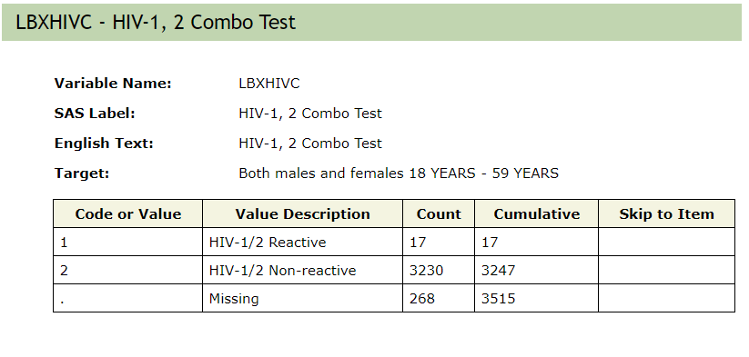

layout: true

<!-- This file by Mine Dogucu is licensed under a  Attribution-ShareAlike 2.5 Generic License (CC BY-SA 2.5) More information about the license can be found at https://creativecommons.org/licenses/by-sa/2.5/ -->
  
<div class="my-header"></div>

<div class="my-footer"> 
 CC BY-SA <a href="https://mdogucu.ics.uci.edu">Mine Dogucu</a></div> 

---
class: center, middle

## License

```{r echo=FALSE, out.width='100%'}
knitr::include_graphics('img/cc-sa.png')
```


More information can be found [here](https://creativecommons.org/licenses/by-sa/2.5/)

---

## Importing .csv Data 


```{r eval = FALSE}
readr::read_csv("dataset.csv")
```
---

## Importing Excel Data

```{r eval = FALSE}
readxl::read_excel("dataset.xlsx")
```

Read in the `cool_study.xlsx` data first by downloading it from the workshop website.  

---
## Importing Excel Data

```{r eval = FALSE}
readxl::read_excel("dataset.xlsx", sheet = 2)
```

---

## Importing SAS, SPSS, Stata Data

```{r eval = FALSE}
library(haven)

# SAS
read_sas("dataset.sas7bdat")

# SPSS
read_sav("dataset.sav")

# Stata
read_dta("dataset.dta")
```

---

## Practice

Download the HIV Antibody Test from the workshop website. Import it into R. 


---

## Writing data files

```{r eval = FALSE}
write_csv(data_frame, "dataset.csv")
write_xls(data_frame, "dataset.xlsx")
```

Similar code pattern holds true for other data formats.


---


```{r echo=FALSE, out.width='100%'}

```

.footnote[[National Health and Nutrition Examination Survey by CDC](https://wwwn.cdc.gov/Nchs/Nhanes/2017-2018/HIV_J.htm)
]

---
## Practice 

1. Change the name of the variable LBXHIVC to `hiv_1_2_combo`

2. Recode level 1 as `"HIV-1/2 Reactive"` and level 2 as `"HIV-1/2 Non-reactive"`

3. Count these levels. 

4. Write the summary table with counts into a `.csv` file.

---

## Schedule for the Day

__08:45 - 09:00 Introduction__  
__09:00 - 09:15 Getting to Know the Basics__  
__09:15 - 10:15 Data Visualization__  
__10:15 - 10:30 Break__  
__10:30 - 12:00 Data Wrangling__  
__12:00 - 01:00 Lunch__  
__01:00 - 01:30 Working Locally With R__  
__01:30 - 02:00 Dealing with Datasets__  
02:00 - 02:30 Case Study  
02:30 - 02:45 Break  
02:45 - 03:30 Modeling  
03:30 - 04:00 Everything I did not have time to cover


