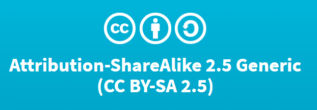

layout: true

<!-- This file by Mine Dogucu is licensed under a  Attribution-ShareAlike 2.5 Generic License (CC BY-SA 2.5) More information about the license can be found at https://creativecommons.org/licenses/by-sa/2.5/ -->
  
<div class="my-header"></div>

<div class="my-footer"> 
 CC BY-SA <a href="https://mdogucu.ics.uci.edu">Mine Dogucu</a></div> 

---
class: center, middle

## License

```{r echo=FALSE, out.width='100%'}

```


More information can be found [here](https://creativecommons.org/licenses/by-sa/2.5/)

---
## LAPD dataset


1. How many full time staff are there? 
2. How many different job class titles are there?
3. Which of the Employment Type group earn the highest Hourly or Event Rate? 
4. Do you notice anything interesting? Investigate. 
5. Is this interesting thing only limited to a single year?

---
## LAPD dataset 2018

6. Moving on we will only use 2018 dataset. Subset the data to only keep observations from 2018 and variables `Employment Type`, `Hourly or Event Rate`, `Total Payments`, `Average Health Cost`, and `Benefits Plan`.

7. Write this subset data to a file called `lapd_subset,csv`. 

---
## LAPD dataset 2018 - Total Payments

8. Start a fresh new .Rmd document. Read in `lapd_subset.csv`.

9. What does the distribution of Total Payments look like? What is your expectation?

10. What are the minimum and maximum total payments?

---
## LAPD dataset 2018 - Benefits

11. How many people have the "Police" benefits plan?

12. What is the percentage of those who have the "Police" benefits plan?

---


## Schedule for the Day

__08:45 - 09:00 Introduction__  
__09:00 - 09:15 Getting to Know the Basics__  
__09:15 - 10:15 Data Visualization__  
__10:15 - 10:30 Break__  
__10:30 - 12:00 Data Wrangling__  
__12:00 - 01:00 Lunch__  
__01:00 - 01:30 Working Locally With R__  
__01:30 - 02:00 Dealing with Datasets__  
__02:00 - 02:30 Case Study__  
02:30 - 02:45 Break  
02:45 - 03:30 Modeling  
03:30 - 04:00 Everything I did not have time to cover


